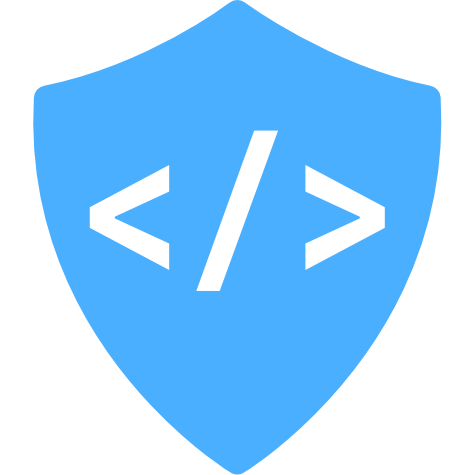

# WebDev Guild

## Purpose

The WebDev Guild was started to help teach basic to advanced programming principles to students. The program is designed to be self-taught, hands-on, and guided by a mentorship program. Students learn web development principles to qualify for badges. Each rank will earn the student a reward!

Read the intro: [Wanted: Curious Learners](intro.md)

Get updates on the [blog](blog)

[Guide for Parents](parents.md)

Join the conversation on [Discord](https://discord.gg/PUcnnjV).

-----

## Badges

- Apprentice
  - [ ] [WebDev](apprentice/webdev.md) *Start Here*
  - [ ] [HTML](apprentice/html.md)
  - [ ] [CSS](apprentice/css.md)
  - [ ] [JavaScript](apprentice/javascript.md)
  - [ ] [Project](apprentice/project.md)
- Journeyman
  - [ ] [WebDev](journeyman/webdev.md)
  - [ ] [CSS](journeyman/css.md)
  - [ ] [JavaScript](journeyman/javascript.md)
  - [ ] [Node](journeyman/node.md)
  - [ ] [Project](journeyman/project.md)
- Master
  - [ ] [React](master/react.md)
  - [ ] [GraphQL](master/graphql.md)
  - [ ] [Databases](master/databases.md)
  - [ ] [The Cloud](master/cloud.md)
  - [ ] [IOT](master/iot.md)
  - [ ] [ThreeJS](master/threejs.md)
  - [ ] [Masterpiece](master/masterpiece.md)

Want to get started? [Contact a Mentor!](#mentors)

-----

## About the Badges

Badges are awarded at the following levels:

- Apprentice
- Journeyman
- Master

### Apprentice 👍
You are getting your feet wet and gaining basic literacy in a skill category. You use study materials to prove a basic knowledge of a skill. You also prove your ability in that skill through building a micro-project with a very specific and prescriptive set of requirements. As an alternative to building new projects, you may use previous work and a few other options to pass this level's badges.

### Journeyman 💪
You are actively applying your knowledge to produce quality code in new and creative ways. You are also demonstrating your knowledge of advanced concepts in your production code. As an alternative to project work, a developer can use previous project or production work to pass this level's badges. You must have previously completed all Apprentice badges to earn the Journeyman rank.

### Master 🔥
You have mastered the fundamental and advanced concepts of this skill and you are very skilled in its application. You often mentor and teach others in skills. You will be qualified to work on large-scale projects with complicated architectures or creative projects with uncommon tools. You must have previously completed all Journeyman badges and have created a Masterpiece to earn the Master rank.

The badges provide suggested and required learning resources, assignments, and additional learning. Students are also encouraged to use search engines and resources like [StackOverflow](https://stackoverflow.com) to find answers to their questions. Mentors are also available to answer questions, but students are encouraged to find their own answers.

To advance in ranks, you must demonstrate your ability in all of the badges by completing a project. For Apprentice and Journeyman level ranks, the project is assigned to you. For the master level, you will work with your mentor to come up with a masterpiece project that will be both challenging and rewarding. 

-----

## Mentors

### Masters

- [Alex Anderson](mailto:alexanderson1993@gmail.com)

### Journeymen

- [Matt Ricks](mailto:mgizmor37@gmail.com)

You can also contact a mentor on [Discord](https://discord.gg/PUcnnjV)

Want to be a mentor? Receive the Apprentice and Journeyman ranks and then file an issue explaining why you think you'd be a good mentor.

-----

## Tracking your Progress

1. Fork this repo.
2. Add your work to the repo showing that you have completed the badges. 
3. Check off your work on the badge page when you have been awarded the badge.

