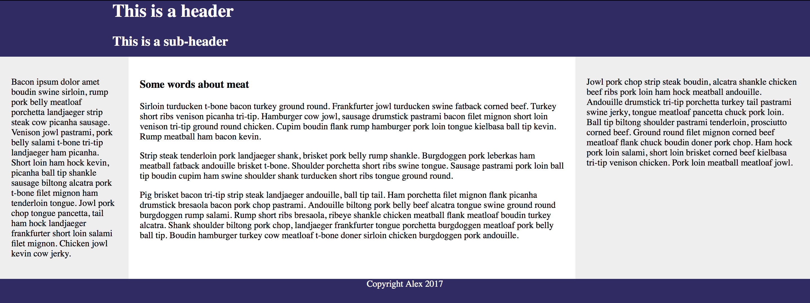
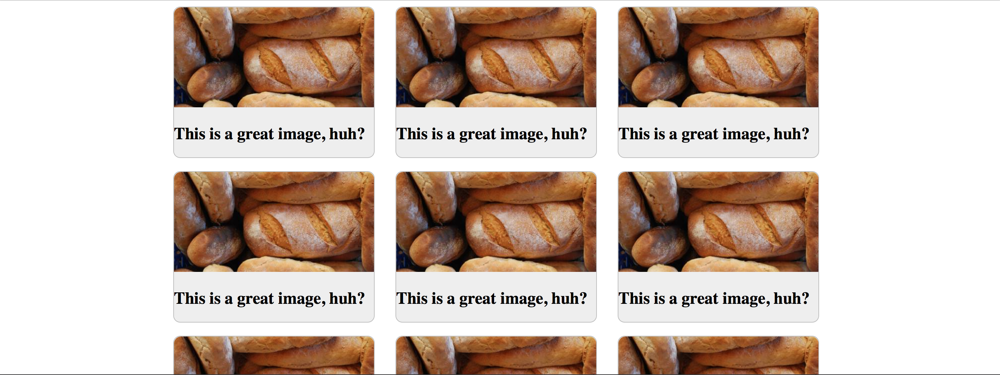

# CSS Flexbox Layout

## Intro

Before Flexbox, doing complicated CSS layouts could be tricky. Now, things like vertical centering and even alignment is simple and straightforward. Flexbox is so useful and ubiquitous, it's even used as the layout engine for mobile app frameworks like React Native! Learning Flexbox will save you a lot of time and pain.

## Suggested Learning

- [Learn Layout Flexbox](http://learnlayout.com/flexbox.html)
- [Flexbox Froggy](http://flexboxfroggy.com)

## Assignments

- Complete the following CodePen assignments:
  - [Flexbox Assignment 1](https://codepen.io/alexanderson1993/pen/LjpEvP?editors=1100)
    - Using only Flexbox, change the CSS of the Codepen to look like this reference image:

  - [Flexbox Assignment 2](https://codepen.io/alexanderson1993/pen/ayvOBb?editors=1100)
      - Using only Flexbox, change the CSS of the Codepen to look like this reference image: *Note: The picture might be different for you. All that matters is the layout.*

- Show your work to your mentor to pass it off.

## Extra Learning

- [Flexbox Cheatsheet](https://css-tricks.com/snippets/css/a-guide-to-flexbox/)
- [Flexbox Zombies](http://flexboxzombies.com/p/flexbox-zombies)
- [Free Flexbox Video Course](https://flexbox.io)
