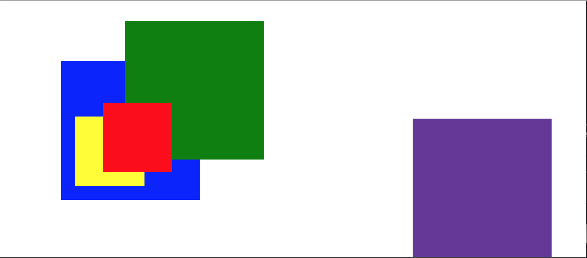
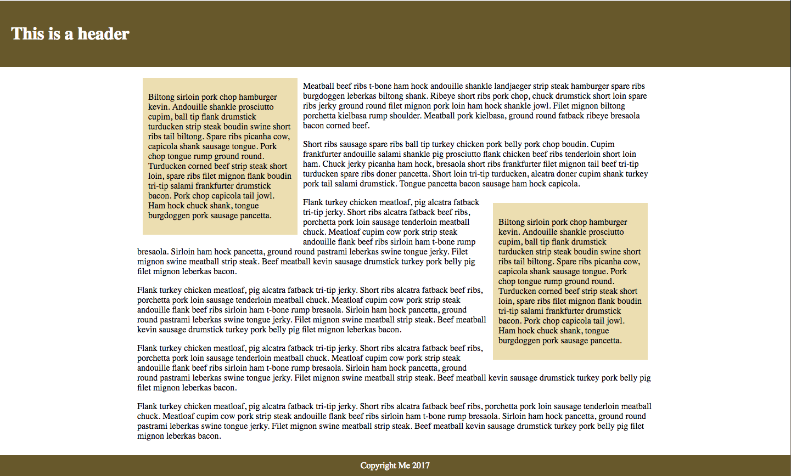

# CSS Layout

## Intro

In the early days of HTML and CSS, you would have to use [tables](http://shouldiusetablesforlayout.com) or invisible images to layout their webpages. Since then, CSS has improved to allow for much more creative layout methods.

There are a lot of new ways to do layout (such as Transforms, Flexbox or CSS Grids). This requirement will focus on the `display`, `position`, `float`, and related attributes. 
## Suggested Learning

- [Learn CSS Layout](http://learnlayout.com) - There's a lot of extra stuff in here too, so pay attention!
- [CSS Box Model](https://www.google.com/url?sa=t&rct=j&q=&esrc=s&source=web&cd=12&ved=0ahUKEwjKr7PDgarVAhXIhFQKHTwoBl4QFghfMAs&url=http%3A%2F%2Flearn.shayhowe.com%2Fhtml-css%2Fopening-the-box-model%2F&usg=AFQjCNGU3mfLsAasdJjHgGbOxHMIFwsqpA)
- [Z-Index](https://developer.mozilla.org/en-US/docs/Web/CSS/z-index)

## Assignments

- Fork and complete the following CodePen assignments:
  - [CSS Layout Assignment 1](https://codepen.io/alexanderson1993/pen/YxyqZp?editors=1100)
    - Using CSS Layout, change the CSS of the Codepen to look like this reference image. Don't worry about getting the sizes exactly right. Just make it look similar:

  - [CSS Layout Assignment 2](https://codepen.io/alexanderson1993/pen/VzvqzN?editors=1100)
    - Using CSS Layout, change the CSS of the Codepen to look like this reference image. Don't worry about getting the sizes exactly right. Just make it look similar:

## Extra Learning

- [HTML & CSS is Hard](https://internetingishard.com/html-and-css/) - More in-depth tutorial

