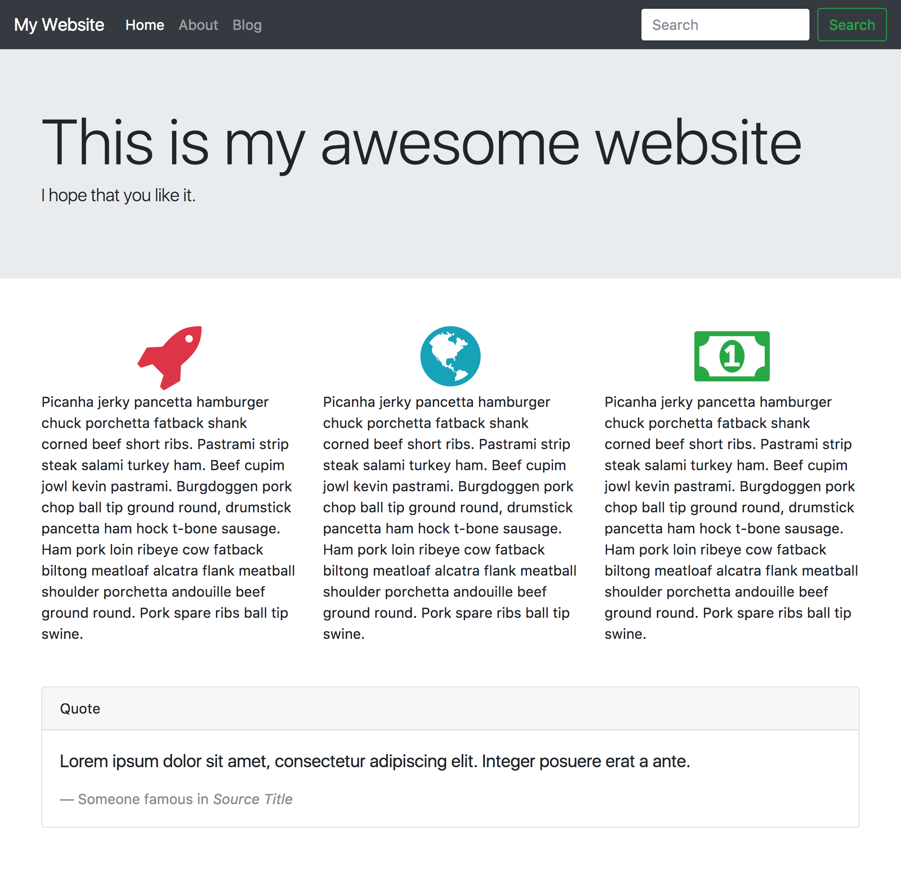

# CSS Frameworks

## Intro

CSS Frameworks are pre-written frameworks that give you classes and styles you can drop into a project to quickly build your website. Bootstrap, one of the most popular CSS frameworks, is named such because it allows you to get up and going with your website without having to spend a lot of time fiddling with CSS.

While there are many CSS frameworks, we'll be focusing on two popular frameworks: Bootstrap and FontAwesome

### [Bootstrap](http://getbootstrap.com)

Bootstrap works by giving you classes which you can apply to your HTML to create rich layouts for your content. Bootstrap provides a plethora of features, including:

* Easy 12-column layouts 
* Fancy buttons and form fields
* Built in JavaScript for interactive components, like modals and tooltips
* Customizable with SASS

### [FontAwesome](http://fontawesome.io)

FontAwesome provides an icon font which you can apply to your HTML with tags and classes. This makes it really easy to put high-quality icons on your site.

* Hundreds of icons
* Classes for changing the size, rotation, animating icons, and stacking icons
* Able to change icon color with CSS

**Note:** CSS Frameworks are a tool, but not a catch-all solution for all of your CSS Problems. CSS Frameworks can give you a lot of power, but they can come with a lot of bloat and extra bytes that your website probably doesn't need. Relying too much on CSS Framworks too early can also limit your CSS skills and make you reliant on a framework. Good places to use CSS frameworks are:

1. When you are building quick mock-ups of websites and apps
1. When you don't need to worry about the file sizes of your project

Bad places to use CSS frameworks are:

1. When you are just getting started with CSS. You might be tempted to use CSS Frameworks to get up and running quickly, but when you start needing complicated CSS, you will find your skills wanting. You'll want to use a CSS framework when you understand what it is doing and how to override it when the time comes.
1. When you care about performance and the size of your files in your project.

## Suggested Learning

- [CSS Resets](http://meyerweb.com/eric/tools/css/reset/) - Learn about how browsers are inconsistent and how resets can improve your cross-browser experience
- Use the links above to look at the documentation for Bootstrap and FontAwesome. Focus specifically on:
    - Grid layout
    - Buttons
    - Form Fields
    - Utilities for sizing, spacing, text-alignment, and colors

## Requirements

- Create a new CodePen.
- **Using only HTML**, create a layout that is similar to the reference image:

- Share a link to your Codepen on the `#requirements` Discord channel to show you have passed this requirement off.

*Hint:* Feel free to copy the code in the examples for Bootstrap and FontAwesome.
*Hint:* You can use the following links in your pen to get Bootstrap and FontAwesome loaded in:
- https://maxcdn.bootstrapcdn.com/bootstrap/4.0.0-beta/css/bootstrap.min.css
- https://opensource.keycdn.com/fontawesome/4.7.0/font-awesome.min.css 

## Extra Learning

*This list is by no means complete. Feel free to add an issue or put in a pull request to update it.*
