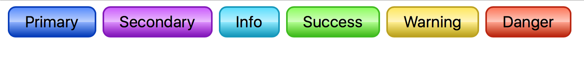

# CSS Preprocessors & More

## Intro

CSS is very powerful, but it isn't a programming language. It only provides limited functionality and doesn't support functions, 'mixins', loops, or other fancy features you might find in a real programming language. (Only recently did CSS start supporting variables.)

CSS Preprocessors are just that. They process special variants of the CSS language into CSS. This processing happens on the developers' computers, long before the webpage user sees the CSS. CSS Preprocessors are powerful tools that can supercharge your ability to write great styles for your websites.

This requirement has information about CSS Linters (which make sure your CSS code is written correctly) and Post-Processors (which process your CSS after it was written or generated by a preprocessor). These are extra tools you can learn about, but not part of these requrements.

## Suggested Learning

- [Read up on a few CSS Preprocessors](https://code.tutsplus.com/tutorials/sass-vs-less-vs-stylus-preprocessor-shootout--net-24320) and pick one you want to use for your assignment. This also serves as a good overview of some of the features you get with CSS Preprocessors
- Sites for the individual Preprocessors:
    - [LESS](http://lesscss.org/)
    - [SASS](http://sass-lang.com/) - Can be used easily with Node: [NodeSass](https://github.com/sass/node-sass) also [Very popular](https://trends.google.com/trends/explore?geo=US&q=%2Fm%2F054k6n_,%2Fm%2F0gjd0jv,%2Fm%2F0py1hbn)
    - [Stylus](http://stylus-lang.com/) - [Installation Instructions](https://github.com/stylus/stylus/) 

*Hint: All of them are good, but Stylus is probably the easiest to get up and going with, and the website is simple to navigate. You should be familiar with all of them someday.*

- Review the documentation for your selected preprocessor to get a feeling for the following:
    - Variables
    - Nesting
    - Parent Reference Selector (`&`)
    - Built-In Functions for Colors and Math
    - Loops and Conditionals
    - Writing and using mixins

## Requirements

- Fork this [Codepen](https://codepen.io/alexanderson1993/pen/rzJrGZ)
- Follow the instructions in the Codepen to match this reference image:

- Share a link to your Codepen on the `#requirements` Discord channel to show you have passed this requirement off.

## Extra Learning

- [Bootstrap](https://github.com/twbs/bootstrap), the popular CSS Framework, is built with SASS. Read the source code to see how they do certain things.

A few other tools for you to study. These go above and beyond the scope of this requirement, but might be helpful for you in future projects:

#### Post-Processors

- [PostCSS](http://postcss.org/)
- [Autoprefixer](https://github.com/postcss/autoprefixer)
- [CSSNext](https://github.com/MoOx/postcss-cssnext)
- [Pleeease](http://www.sitepoint.com/css-post-processing-pleeease/)

#### Linting & Static Analysis

- [CSScomb](http://csscomb.com/)
- [CSSLint](https://github.com/CSSLint/csslint)
- [stylelint](http://stylelint.io/)
- [stylefmt](https://github.com/morishitter/stylefmt)
 
#### Redundancy and Unused Styles

- [UnCSS](https://github.com/giakki/uncss)
- [CSSCSS](http://zmoazeni.github.io/csscss/)
- [PurifyCSS](https://github.com/purifycss/purifycss)
- [Helium CSS](https://github.com/geuis/helium-css)

#### Minifiers

- [CleanCSS](https://github.com/jakubpawlowicz/clean-css)
- [CSSO](https://github.com/css/csso)
- [CSS Nano](https://github.com/ben-eb/cssnano)

*This list is by no means complete. Feel free to add an issue or put in a pull request to update it.*
